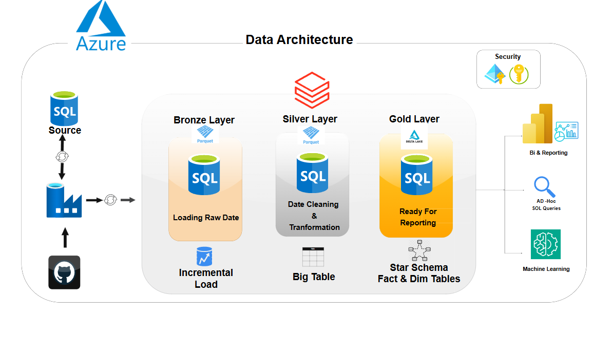

# Automated Azure ETL Pipeline for E-Commerce Data

  Welcome to My **Automated Azure ETL Pipeline for E-Commerce Data**Project! this project design and implementation of an **Automated Azure ETL pipeline** using **ADF** and **Databricks** to process e-commerce data with incremental loading and **Star Schema* modeling.

## Overview
   This project demonstrates the design and implementation of an **automated ETL (Extract, Transform, Load) pipeline** in **Microsoft Azure** for processing e-commerce sales data. The solution leverages **Azure Data Factory (ADF)** for orchestration, **Azure Databricks** for data transformation, and **Azure Data Lake Storage Gen2** for scalable data storage. An **incremental data loading mechanism**and **Star Schema**data model ensure optimized performance, scalability, and maintainability

## Data Architecture Diagram

 This project follows a **Medallion Architecture** to structure e-commerce data in **Azure Data Lake**
 

**Bronze Layer**  
   - Stores raw ingested data from various sources (Github) 
**Silver Layer**  
   - Cleans, deduplicates, and applies incremental load using **Azure Databricks**   
**Gold Layer**  
   - Aggregated data ready for reporting and BI tools  
   - Star Schema applied for **Fact and Dimension tables**  

 ## Tech Stack

Cloud Platform  -	Microsoft Azure
Orchestration	  - Azure Data Factory
Transformation  -	Azure Databricks (PySpark)
Storage	        - Azure Data Lake Storage Gen2
Database        - Azure SQL Database 
Data Modeling	  - Star Schema (Fact & Dimension Tables)
Automation      -	ADF Pipelines + Triggers
Version Control -	GitHub

## ETL Flow (Medallion Architecture)

### Extract (Raw Load to SQL Database)
-Raw e-commerce sales data is ingested from source files ( APIs)
-Loaded directly into Azure SQL Database as the initial raw layer

### Transform (Databricks Processing)
-Azure Databricks reads the raw SQL data
-Cleans, joins, and applies business logic
-Implements incremental load to process only new or updated records
-Prepares data for Star Schema modeling (Fact + Dimension tables)

### Load (Delta Lake in Data Lake)
-Transformed data is written into Azure Data Lake Storage (Silver & Gold layers) in Delta format
-Enables efficient ACID transactions, time-travel, and optimized analytics

### Automate (Orchestration with ADF)
Azure Data Factory (ADF) pipelines orchestrate all steps
Pipelines are scheduled or triggered manually for fully automated ETL processing

## Author
Thayanithi K
Data Engineer | Azure Data Specialist
📧 your.email@example.com

🔗 LinkedIn
 | Portfolio
 
