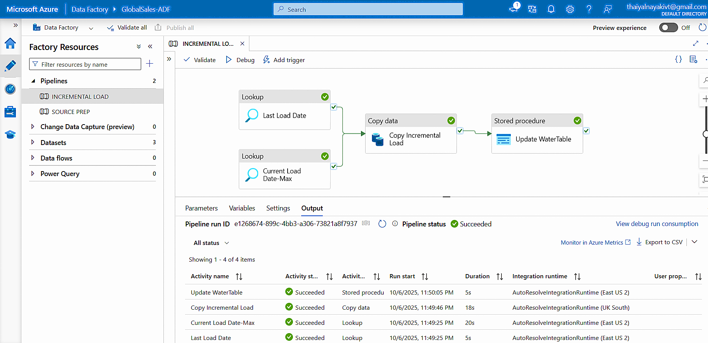
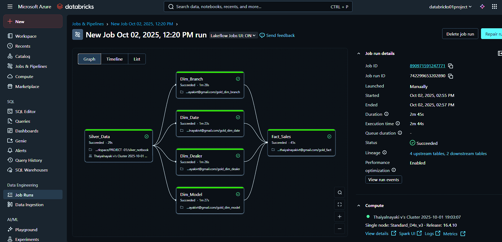

# Automated Azure ETL Pipeline for E-Commerce Data

Welcome to my **Automated Azure ETL Pipeline for E-Commerce Data** project! This project focuses on the design and implementation of an **Automated Azure ETL pipeline** using **ADF** and **Databricks** to process e-commerce data with incremental loading and **Star Schema** modeling.

## Overview
This project demonstrates the design and implementation of an **automated ETL (Extract, Transform, Load) pipeline** in **Microsoft Azure** for processing e-commerce sales data. The solution leverages **Azure Data Factory (ADF)** for orchestration, **Azure Databricks** for data transformation, and **Azure Data Lake Storage Gen2** for scalable data storage. An **incremental data loading mechanism** and **Star Schema** data model ensure optimized performance, scalability, and maintainability.

## Data Architecture Diagram

This project follows a **Medallion Architecture** to structure e-commerce data in **Azure Data Lake**.

**Bronze Layer**  
- Stores raw ingested data from various sources (APIs).  

**Silver Layer**  
- Cleans, deduplicates, and applies incremental load using **Azure Databricks**.  

**Gold Layer**  
- Aggregated data ready for reporting and BI tools.  
- Star Schema applied for **Fact and Dimension tables**.  

## Tech Stack

| Component        | Technology                                  |
|-----------------|---------------------------------------------|
| Cloud Platform   | Microsoft Azure                             |
| Orchestration    | Azure Data Factory                           |
| Transformation   | Azure Databricks (PySpark)                  |
| Storage          | Azure Data Lake Storage Gen2                 |
| Database         | Azure SQL Database                           |
| Data Modeling    | Star Schema (Fact & Dimension Tables)       |
| Automation       | ADF Pipelines + Triggers                     |
| Version Control  | GitHub                                       |

## ETL Flow (Medallion Architecture)

### Extract (Raw Load to SQL Database)

- Raw e-commerce sales data is ingested from source files (APIs).  
- Incrementally loaded directly into Azure SQL Database as the initial raw layer.

### Transform (Databricks Processing)

- Azure Databricks reads the raw SQL data.  
- Cleans, joins, and applies business logic.  
- Implements incremental load to process only new or updated records.  
- Prepares data for Star Schema modeling (Fact + Dimension tables).

### Load (Delta Lake in Data Lake)

- Transformed data is written into Azure Data Lake Storage (Silver & Gold layers) in Delta format.  
- Enables efficient ACID transactions, time-travel, and optimized analytics.

### Automate (Orchestration with ADF)

- Azure Data Factory (ADF) pipelines orchestrate all steps.  
- Pipelines are scheduled or triggered manually for fully automated ETL processing.

## Project Structure

├── .git/
├── datasets/                         ← Raw and incremental datasets
│   ├── e_commerce_dataset.csv        ← Full historical e-commerce data
│   └── incremental_data.csv          ← New incremental data
├── scripts/                          ← ETL notebooks and scripts
│   ├── Create_DB.ipynb               ← Notebook to create SQL tables
│   ├── Data_Transformations.ipynb    ← Cleaning & transformation logic
│   ├── Dim_Customer.ipynb            ← Dimension table processing
│   ├── Dim_Order.ipynb               ← Dimension table processing
│   ├── Dim_Product.ipynb             ← Dimension table processing
│   └── Fact_Sales.ipynb              ← Fact table processing
├── docs/                             ← Documentation
│   ├── data_architecture.png         ← Medallion architecture diagram
│   ├── incremental_pipeline.png      ← ADF Workflow
│   ├── databricks_workflow.png       ← Databricks workflow
│   └── entity_diagram.png            ← Entity Relationship Diagram (ERD)
├── LICENSE
└── README.md

## Author

**Thayanithi K**  
📧 thayanithikarun@gmail.com  
🔗 LinkedIn: [www.linkedin.com/in/thayanithi-k-3b4648373](https://www.linkedin.com/in/thayanithi-k-3b4648373)
